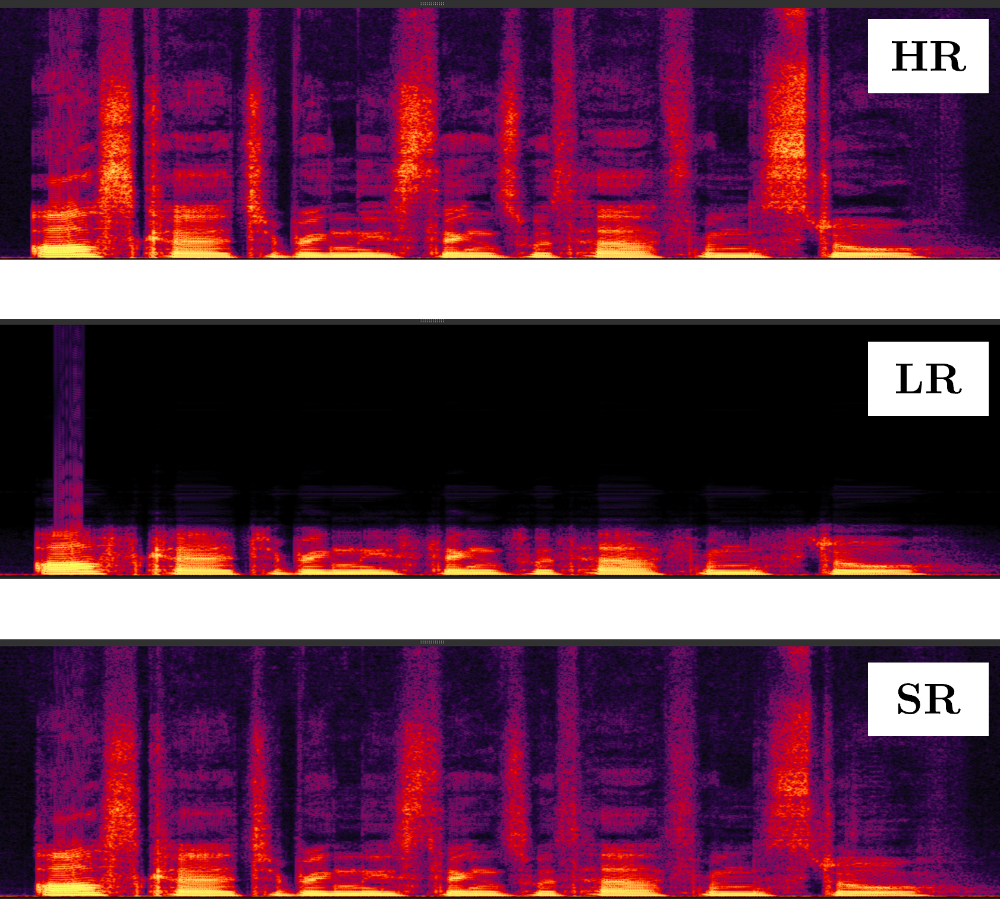
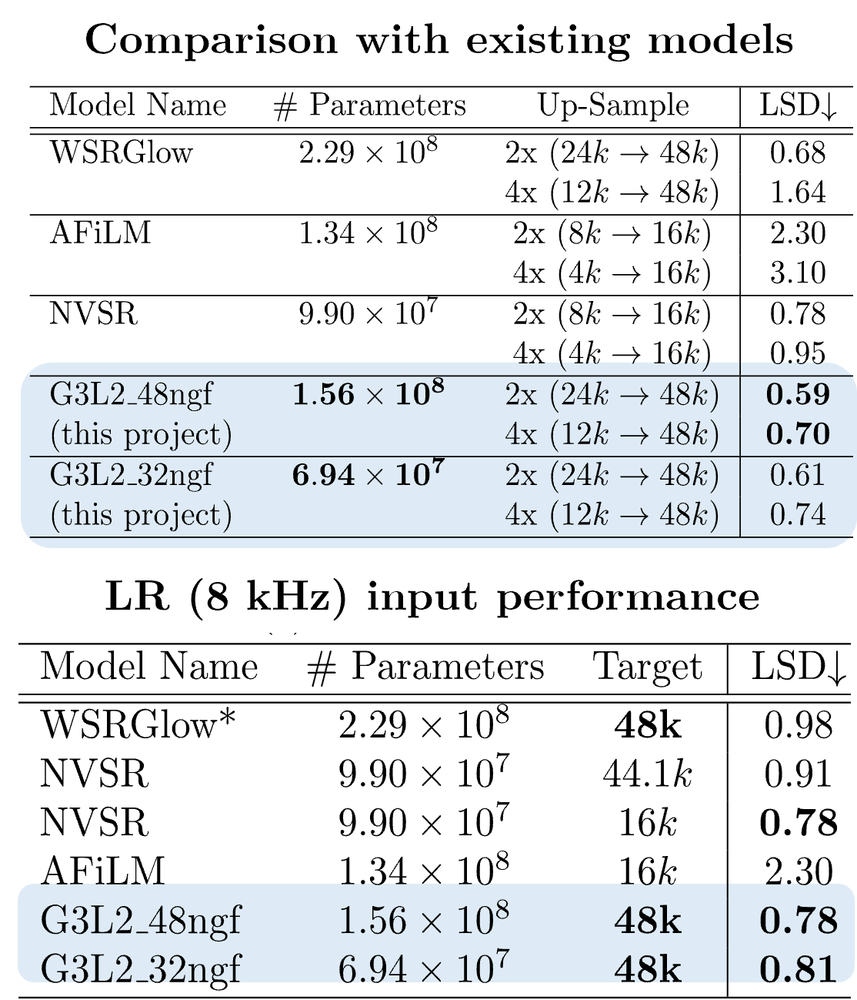
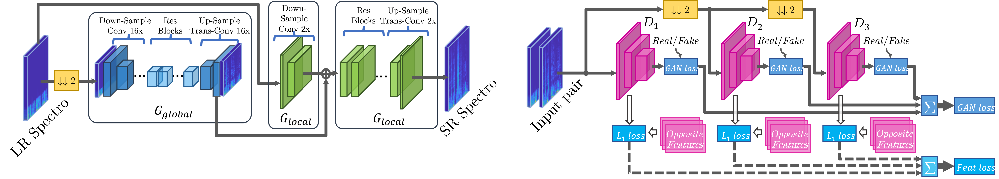
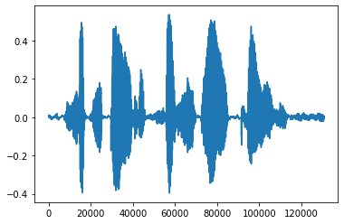
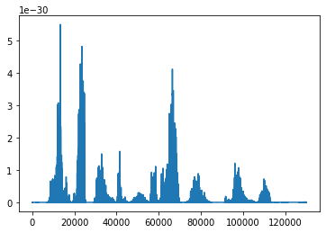
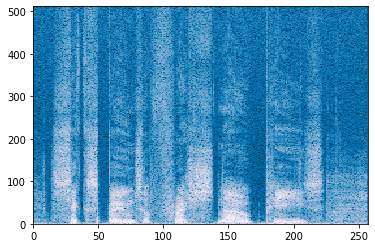

# Speech Super-resolution with pix2pixHD Framework
## Introduction
<p align='center'>  
  
  
</p>
This is the code repository for my bachelor's degree Final Year Project design. I use the framework of pix2pixHD for the generation of high-resolution audio spectra.

Instead of using Mel-spectrogram, I proposed to use **MDCT spectrogram** as the generation target, which is real-valued and phase-aware. It can be seen as the "DCT" version of STFT. More importantly, you can converted MDCT spectrogram back to raw waveform immediately *without using any Vocoder or Griffin-Lim algorithm*.

## pix2pixHD for spectrograms generation

This repo is based on [official pix2pixHD implementation](https://github.com/NVIDIA/pix2pixHD). I did not modify the backbone network and keep it as original. However, since it is proposed for image generation and some of them are not suitable for audio spectrograms, some code is deprecated, such as Encoder network, VGG loss and image pre-processing (scale, rotate...).

The modtivation of this project is I notice the super-resolution task in time-freq domain is more like a Image Completion task: We can use cGANs to fill up the missing high-freq component according to the low-freq condition. So a adopted pix2pixHD GAN. And I use the low-res spectrogram as input and high-res spectrograms as label, performing SR like Image-to-Image translation.

### Audio datasets
See implementation in `data.audio_dataset.AudioDataset`. It has two mode to search for training audio files with the arg `--dataroot`: 1) you feed in a path to audio files, or 2) you feed in a path to a csv file recording path to audio files,  like this:
```sh
$ cat /root/VCTK-Corpus/train.csv | head -n 10
wav48/p343/p343_294.wav
wav48/p339/p339_081.wav
wav48/p326/p326_062.wav
wav48/p297/p297_017.wav
wav48/p323/p323_230.wav
wav48/p318/p318_261.wav
wav48/p252/p252_059.wav
wav48/p285/p285_388.wav
wav48/p266/p266_309.wav
wav48/p363/p363_120.wav
...
```
You can use `find` command to generate such a file:
```sh
cd /root/VCTK-Corpus
find -iname "*.flac" > audio.csv
```

The second mode is highly recommanded, since the first mode will walk through the given path and it is extremely slow when there are too many files.

The `data.audio_dataset.AudioDataset` will randomly cut a segment of audio if the file is longer than arg setting `--segment_length` or pad zeros if it shorter. Since audio super-resolution requires paired data (LR and HR waveform), the input will be re-sampled to a lower rate, then re-sampled to target rate to get LR waveform. Such a process makes the LR waveform and the HR waveform in the same length.

I also modified the input encoding process. Then the model will convert all the audio to spectrograms in batches, with CUDA acceleration if GPUs are available.

The APEX implementation of FP16 training is changed to `torch.cuda` native implementation.

## PyTorch implementation of The MDCT/IMDCT spectrogram
Wikipedia's definition:
>The modified discrete cosine transform (MDCT) is a transform based on the type-IV discrete cosine transform (DCT-IV), with the additional property of being lapped: it is designed to be performed on consecutive blocks of a larger dataset, where subsequent blocks are overlapped so that the last half of one block coincides with the first half of the next block.

The forward transform is given by:


and the inverse is


I followed the MATLAB's implementation of `mdct()` and `imdct()` and made a PyTorch version with `torch.fft` api, so that they are all back-propagatable. They can convert signal in batches, so it is super fast. It is loacted in `model.mdct.MDCT4` and `model.mdct.IMDCT4`.

### Usage
The usage is quite similar with `torch.stft()`. You can set the frame length, the hop length, the window function and the num of FFT points. Here is an example.

Firstly load audio samples:
```py
import torchaudio
import matplotlib.pyplot as plt
import torch
import torchaudio.functional as aF
audio_path = '/root/VCTK-Corpus/wav48/p227/p227_003.wav'
audio, fs = torchaudio.load(audio_path)
K = 50000
audio_seg = audio[...,K:130816+K].squeeze()
print(audio_seg.mean())
plt.plot(audio_seg)
plt.show()
```


Then we convert it to MDCT spectrograms and convert it back to waveform.
```py
from models.mdct import MDCT4, IMDCT4
from util.util import kbdwin
mdct4 = MDCT4(n_fft=1024, hop_length=512, win_length=1024, window=kbdwin, center=True, device='cuda')
imdct4 = IMDCT4(n_fft=1024, hop_length=512, win_length=1024, window=kbdwin, center=True, device='cuda')
# Test reconstruction error
audio_seg.requires_grad_()
spectro = mdct4(audio_seg.cuda())
print(spectro.size())
reconstruction = imdct4(spectro.unsqueeze(0))
err = (audio_seg.cpu().squeeze()[:130000] - reconstruction.squeeze().cpu()[:130000])**2
print(err.mean())
# Plot error
plt.plot(err.detach())
plt.show()
# Test grad backward
grad_test = torch.sum(spectro+torch.randn(spectro.size()).cuda())
grad_test.backward()
print(audio_seg.grad)
```
Output:
```
torch.Size([257, 512])
tensor(4.8908e-32, dtype=torch.float64, grad_fn=<MeanBackward0>)
tensor([   0.7082,   -0.7104,    0.7126,  ...,  -47.5344,   78.2740,
        -231.9366])
```


```py
spectro_ = aF.amplitude_to_DB((spectro.detach().permute(1,0).abs() + 1e-4),20,1e-4,1).squeeze(0)
plt.pcolormesh(spectro_.detach().cpu().numpy(), cmap='PuBu_r')
plt.show()
```
Output:



### DCT-II version
Instead of DCT-IV version of MDCT, I also implemented DCT-II/DCT-III version of DCT-based spectrogram. And it is loacted in `model.mdct.MDCT2` and `model.mdct.IMDCT2`. All the configurations are same as `model.mdct.MDCT4`, but the output shape is different: the freqency dim is double length of that of `model.mdct.MDCT4`.

Notice: *This project is based on `model.mdct.MDCT2` and `model.mdct.IMDCT2`*. You can also try to train the network on `MDCT4`.

## Training
All my test setting records are in `train_script.sh`. Here I put a working training settings:
```sh
python train.py \
--name VCTK_G3L2_48ngf \
--dataroot /root/VCTK-Corpus/wav48 --validation_split 0.01 \
--no_instance --no_vgg_loss \
--label_nc 0 --output_nc 2 --input_nc 2 \
--batchSize 64 --fp16 \
--gpu_id 0 \
--nThreads 16 \
--mask --mask_mode mode2 \
--netG local \
--niter 50 --niter_decay 50 \
--abs_spectro --center \
--explicit_encoding \
--n_blocks_global 3 --n_blocks_local 2 --ngf 48 \
--eval_freq 5000 --save_latest_freq 2000 --save_epoch_freq 20
```

You can generate audio with trained models:
```sh
python generate_audio.py \
--name GEN_VCTK_G3L2_48ngf \
--checkpoints_dir ./generated \
--dataroot /root/pix2pixHD/test/test.wav \
--load_pretrain ./checkpoints/VCTK_G3L2_48ngf \
--no_instance --no_vgg_loss --validation_split 0 \
--label_nc 0 --output_nc 2 --input_nc 2 \
--batchSize 4 --serial_batches \
--gpu_id 3 --nThreads 0 \
--mask --mask_mode mode2 \
--netG local \
--abs_spectro --center --explicit_encoding \
--n_blocks_global 3 --n_blocks_local 2 --ngf 48 \
--phase test
```
Remember to use `--phase test` arg to enable `AudioTestDataset` dataloader to load a single audio file. And use `--serial_batches` so that it wont shuffle the input batches.

## Acknowledgments & Announcement
This code is built based on [official pix2pixHD implementation](https://github.com/NVIDIA/pix2pixHD). The DCT implementation is based on [DREAMPlace](https://github.com/limbo018/DREAMPlace). Thank you guys!😘

This is just my bachelor's degree Final Year Project. And since all of these are done by myself, I do not have much time on writing comments or beautify the code. I know it is painful when you read my sh💩t code without comments. I am sorry about that😥. If you have any questions / suggestion, or found any bugs, welcome to raise a issue / PR. I can understand English 🇬🇧 and Chinese 🇨🇳. 😊